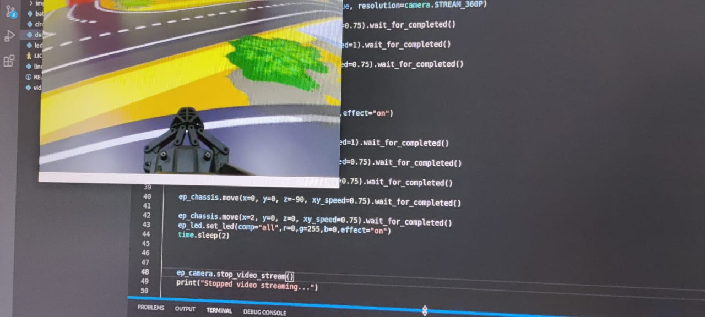

# MobileRobot-Openloopcontrol
## Aim:

To develop a python control code to move the mobilerobot along the predefined path.

## Equipments Required:
1. RoboMaster EP core
2. Python 3.7

## Procedure

Step1: design the pattern to move the mobile robot

<br/>

Step2: check your pattern for any errors in it

<br/>

Step3:after checking for errors start programing

<br/>

Step4:place the mobile robot in starting postion

<br/>

Step5:run the program

<br/>

## Program
```python
from robomaster import robot
import time

if __name__ == '__main__':
    ep_robot = robot.Robot()
    
    ep_robot.initialize(conn_type="ap")

    ep_chassis = ep_robot.chassis
    
    ep_chassis.move(x=2, y=0, z=0, xy_speed=0.75).wait_for_completed()

    ep_chassis.move(x=0, y=0, z=90, xy_speed=1).wait_for_completed()

    ep_chassis.move(x=2, y=0, z=0, xy_speed=0.75).wait_for_completed()

    ep_robot.close()
```

## MobileRobot Movement Image:


Insert image here


<br/>
<br/>
<br/>
<br/>

## MobileRobot Movement Video:

Upload your video in Youtube and paste your video-id here

https://www.youtube.com/watch?v=5LrBBlLG7UQ

## Result:
Thus the python program code is developed to move the mobilerobot in the predefined path.


<br/>
<br/>

```
Mobile Robotics Laboratory
Department of Artificial Intelligence and Data Science/ Machine Learning
Saveetha Engineering College
```
